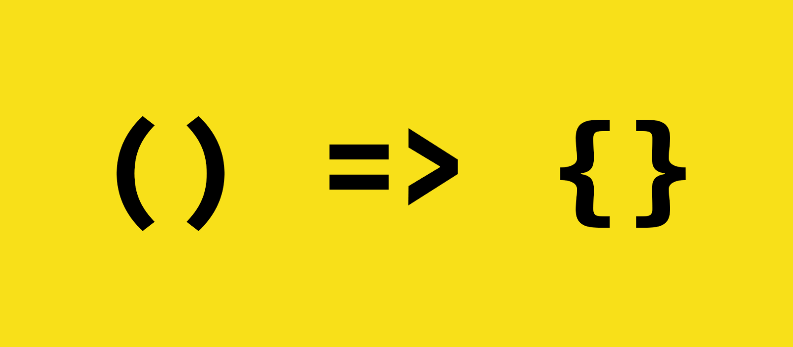
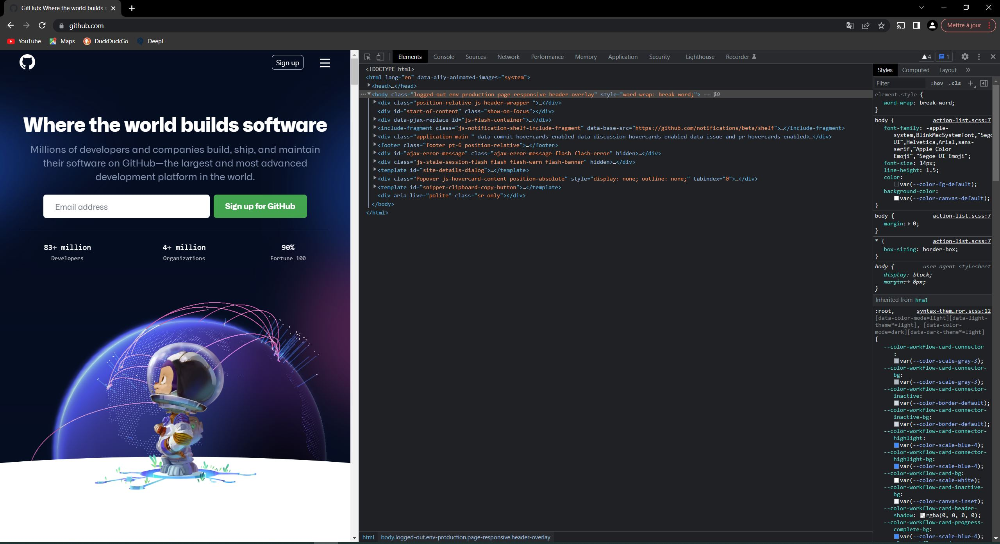
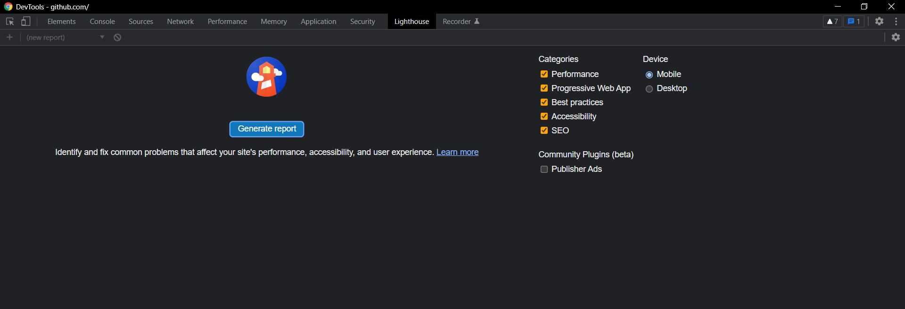

<!--
paginate: true
_paginate: false
headingDivider: 2
footer: 'ETML-ES / Base JS et outils de débuggage'
header: ' [](https://github.com/NF01/mthw/blob/main/Partie1_BaseJSOutilsDebug.md)'
size: 16:9
-->

<style>

@import url('https://fonts.googleapis.com/css2?family=Nunito&display=swap');
@import url('https://fonts.googleapis.com/css2?family=Red+Hat+Mono:wght@600&display=swap');

@font-face {
  font-family: 'icomoon';
  src: url('./fonts/icomoon.ttf') format('truetype');
}


section h1 {
  font-size: 1.5rem;
  font-family: 'Nunito';
  color: black;
  padding-bottom: 1rem;
  padding-top:10px

}

section.align h1{
  padding-bottom: 0.5rem
}

section p {
  font-size: 0.7rem;
  font-family: 'Nunito', sans-serif;
}

section footer {
  font-size: 0.5rem;
  font-family: 'Nunito', sans-serif;
}


section header a:nth-child(1):after{
  font-size: 0.9rem;
  font-family: 'icomoon', sans-serif;
  content: "\eab0";
  color: black;
  opacity: 30%
}


section::after {
  font-size: 1rem;
  font-family: 'Nunito', sans-serif;
}

section code{
  font-family: 'Red Hat Mono', monospace;
  font-size: 5rem
}

section a{
  color: #D10A11;
}

section li{
  font-size: 0.7rem;
  font-family: 'Nunito', sans-serif;
  
}


</style>

# Partie 1: Base de JS et outils de débuggage

Dans cette première partie nous allons nous concentrer sur les bases de JS pour construire une PWA au goût du jour (en date du millieu 2022). Pour ce cas nous allons voir:

1. Les fonctions fléchées
2. L'asynchronicité en JS
3. Différents outils de débuggage

# JS and the fabulous arrow function

[](https://www.north-47.com/knowledge-base/https-www-north-47-com-knowledge-base-difference-between-normal-and-arrow-functions/)

---

### old one

```js
let x = myFunction(4, 3);
function myFunction(a, b) {
  return a * b;
}
console.log(x); //output = 12
```

### new one

```js
const myfunction = (a, b) => a * b;
console.log(myfunction(4, 3)); //output = 12
```

# Less is more

Les fonctions fléchés surtout appelées "arrow function" ont été introduites dans JS pour compacter le langage et le rendre plus lisible et moins onereux en lignes de code.

### Particularités

- Dès que la fonction doit s'étaler sur plusieur lignes (pour une meilleure lisibilité par exemple) les accolades _{ }_ doivent être présentes et le mot réservé _return_ doit être rajouté.

```js
const myfunction = (a, b) => {
  let x = a * b;
  if (x > 3) return "hello world";
};
console.log(myfunction(4, 3)); //output = hello world
```

- 2 points importants: les arrow function ne peuvent être utilisées pour un constructueur (orienté objet) ni en tant que méthode dans une classe par exemple.

# Ressources

[MDN docs](https://developer.mozilla.org/en-US/docs/Web/JavaScript/Reference/Functions/Arrow_functions)

[47N article, difference between arrow function and normal function](https://medium.com/dailyjs/es6-arrow-functions-cheatsheet-3d42cfe17d72)

[Medium article, cheatsheet arrow function](https://medium.com/dailyjs/es6-arrow-functions-cheatsheet-3d42cfe17d72)

# Asynchronous code

[](https://geekflare.com/javascript-event-loops/)

# Commençons par le commencement.

Un langage de programmation est une langue qui permet de converser avec la machine. Néanmoins la machine finira toujours par parler en binaire et l'humain en anglais (l'anglais ici pour faciliter la démonstration). Il a donc fallu trouver un juste millieu => tous les langages de prog.

Parmis ces langages il y a JavaScript. Comme écrit dans son nom, JS est un langage de script et il doit donc être interprété. Cette interpréteur (engine in english) s'appelle [ChromeV8](https://www.cloudflare.com/fr-fr/learning/serverless/glossary/what-is-chrome-v8/). Cet interpréteur est incorporé à l'interne de tous les browser modernes. C'est pour cela que JS est un de rares langages de programation a être compris nativement par les browser.

# Caractéristiques de JS

Il faut savoir que le code JS normal est dit "synchrone" car il exécute ses directives (= ce qu'on lui demande de faire) les unes après les autres.

```js
console.log("Hello World");
console.log(2+3);

//output
Hello world
5
```

Jusqe là : normal.

Sauf que Javascript est bien plus puissant que ça et cela grâce à son code asynchrone et à sa boucle d'événement (event loop).

---

<!--backgroundColor: #ebebeb-->

### Event loop et code asynchrone

[](https://levelup.gitconnected.com/javascript-and-asynchronous-magic-bee537edc2da)

À l'interne du runtime engine (ChromeV8) il y a les fonctions natives à ChromeV8 (exemple console.log). Cependant ChromeV8 va pouvoir se connecter à ce qu'on appelle des Web APIs qui elles seront asynchrones. Pour que cela marche ChromeV8 va envoyé la fonction ne faisant pas partie du coeur natif de l'engine (exemple setTimeout()) à la Web API dédiée. Quand la Web API aura finie de calculer la fonction elle va l'envoyer à la callback queue. Là rentre en jeu l'envent loop car son "seul" rôle sera d'envoyer les éléments de la queue à la stack.

# Les promesses

<!--backgroundColor: white-->

Les promesses sont la suite logique au code asynchrone, car elle seront **toujours asynchrone**. Elle vont comme leur nom l'indique vous faire une promesse de réponse. Vous recevrez une de ce trois réponses c'est certain.

- Pending, la promesse est en attente
- Resolved, la prommese est bien résolue
- Rejected, la promesse n'a pas été acceptée

La compréhension des promesses est surout très utile car elle seront utlisée lors d'appel asynchroness et lors de l'utilisation de divers Web API pour construire notre PWA.

# async / await

Les mots clefs async et await sont un moyen d'orthographier notre code quand une utilise des promesses (et donc du code asynchrone et donc l'event loop, tout est lié :smile:)

```js
//async est mis au début de ma fonction pour avertir que celle-ci est asynchrone
const fetchGET = async (url) => {
  const myinit = { method: "GET" };

  try {
    //le try and catch est ici une façon de récuérer l'erreur si les promesses ont une erreur
    //je peux ensuite enchainer les await pour appeler différentes promesses
    const response = await fetch(url, myinit); //ici une prommesse utilisant la WEB API fetch
    const responseJSObject = await response.json(); //ici la même chose mais avec la WEBP API json
    return responseJSObject; //je retourne ma réponse "si tout c'est bien passé"
  } catch (err) {
    //je rattrape l'erreur seuleument si il y en a une
    return err; //je retourne cette réponse à la place de ma réponse "si tout c'est bien passé"
  }
};
```

# Ressources

[Complément au cours: asynchronicité de JS + promesses + asnyc/await ](https://mediacomem.github.io/comem-archioweb/2021-2022/subjects/js-promises/?home=MediaComem%2Fcomem-archioweb%23readme#1)

[Boucle d’événement, que diable est ce au fait ? Video Youtube](https://www.youtube.com/watch?v=8aGhZQkoFbQ)

[Event loop, MDN](https://developer.mozilla.org/en-US/docs/Web/JavaScript/EventLoop)

# Outils de débuggage

Les outils de bébuggage sont tous présent dans la section inspection de votre browser (ici Chrome pour la démonstration). Pour la trouver => clique droit => inspecter



---

La section "application" nous permettra d'utiliser la base de donnée côté client, le cache et le local storage (des noms qui vous seront expliqués plus tard)


---

La section "Lighthouse" (seuleument disponible sur Chrome) nous permettra de faire des audits de note PWA pour savoir si elle est côté celon les normes en vigeures.



# Ressources

[Chrome outil de développememt](https://developer.chrome.com/docs/devtools/)
