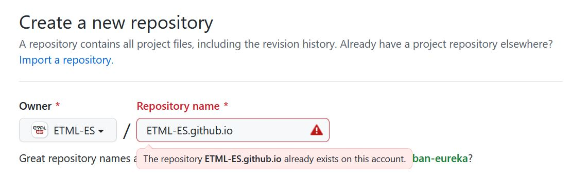

<!--
paginate: true
_paginate: false
headingDivider: 2
footer: 'ETML-ES / Introduction PWA'
header: ' [](https://github.com/NF01/mthw/blob/main/Partie3_MiseEnPlaceEx.md) '
size: 16:9
-->

 <!-- 
 script to link to html to enable darkmode
 <script defer src="index.js"></script>
 -->

<style>


@import url('https://fonts.googleapis.com/css2?family=Nunito&display=swap');
@import url('https://fonts.googleapis.com/css2?family=Red+Hat+Mono:wght@600&display=swap');
@font-face {
  font-family: 'icomoon';
  src: url('./fonts/icomoon.ttf') format('truetype');
}
section h1 {
  font-size: 1.5rem;
  font-family: 'Nunito';
  color: black;
  padding-bottom: 1rem;
  padding-top:10px
}
section.align h1{
  padding-bottom: 0.5rem
}

section p {
  font-size: 0.7rem;
  font-family: 'Nunito', sans-serif;
}

section footer {
  font-size: 0.5rem;
  font-family: 'Nunito', sans-serif;
}
section header a:nth-child(1):after{
  font-size: 0.9rem;
  font-family: 'icomoon', sans-serif;
  content: "\eab0";
  color: black;
  opacity: 30%
}
section::after {
  font-size: 1rem;
  font-family: 'Nunito', sans-serif;
}
section code{
  font-family: 'Red Hat Mono', monospace;
  font-size: 5rem
}
section a{
  color: #D10A11;
}

section li{
  font-size: 0.7rem;
  font-family: 'Nunito', sans-serif;

}

</style>

# Partie 3: Mise en place de l'environnement d'exercice

Dans cette partie, nous allons commencer à mettre en place notre exercice qui consistera à créer une PWA.

# Pour débuter

1. Créer un nouveau repository Github
   **ATTENTION** nommez le: _votrePseudoGithub.github.io_ ( nous verrons pourquoi par la suite, déjà une petite idée ? )

   

---

2. Clonez votre repository sur votre machine
3. Ouvrez-le dans votre éditeur/IDE favori
4. Créez une architecture de dossier suivant cette proposition (_italique_ = dossier / **gras** = fichier)
   - _dist_
     - _assets_
     - _style_
     - **index.html**
     - **main.js**
5. Créez un squelette HTML de base (raccourcis clavier dans VSCode => _!_ + _enter_ ).
6. Ajoutez y le titre de la PWA dans la balise _title_ => Ciné★thèque.
7. Ajoutez dans la balise _head_ la ligne

   ```HTML
   <script defer scr="main.js"><script>
   ```

   **Point théorique**: le mot clé _defer_ rend possible la déclaration de la balise _script_ dans la balise _head_ même si celle-ci se trouve au tout début du document HTML. Le chargement du script se fera quand même après le HTML. _defer_ agit de la même façon que si le script avait été déclaré à la fin du document HTML.

---

8. Rajoutez cette ligne dans le fichier _main.js_

   ```js
   console.log(42);
   ```

9. Pour voir si tout ce que nous avons fait marche, il faut mettre en place un serveur web de développement. Vous avez le choix ! Soit vous êtes dans VSCode ou tout autre IDE qui implémente un live-server, vous lancez donc juste votre serveur. Soit vous installez un live-server sur votre machine qui marchera partout, peu importe votre IDE. Plus besoin d'être tributaire de votre éditeur de code.
   - **OPTIONEL**: pour faire cela, un peu de mise en place.
     - Premièrement, il faut avoir [NodeJS](https://nodejs.org/en/) d'installé sur votre machine, car nous allons installer ce qui s'appelle un _package npm_.
     - Il faut savoir qu'en installant _NodeJS_ le package manager (_npm_ pour Node Package Manager) de celui-ci est aussi installé. Vous avez donc la possibilité d'utiliser l'entièreté des package mis à disposition par la communauté sur le site de [npm](https://www.npmjs.com/).
     - Nous allons pour notre part nous intéresser au package [live-server](https://www.npmjs.com/package/live-server). Ce package que nous allons installer **globalement** pour qu'il puisse être indépendant de notre projet, nous permettra, après configuration, de lancer un live-server pour notre projet en une seule petite commande.
     - Pour l'installation, insérez cette ligne dans votre console bash
     ```bash
     $> npm install -g live-server
     ```

---

10. **SUITE OPTIONEL** vous avez donc _live-server_ d'installer globalement sur votre machine. Pour information complémentaire sur une machine Windows, le fichier se trouve sous:

    ```
    C:\Users\votreNomDeUsers\AppData\Roaming\npm
    ```

    Maintenant dernière configuration, nous allons créer un fichier _package.json_ dans notre repository que nous venons de cloner et où nous avons déjà amené une architecture de dossier (ce fichier viendra se positionner à la racine). Copier-coller le code suivant dans votre fichier nommé _package.json_.

    ```json
    {
      "name": "cinemathequepwa",
      "version": "1.0.0",
      "main": "index.html",
      "scripts": {
        "dev": "live-server dist/"
      },
      "author": "NF01",
      "license": "MIT"
    }
    ```

    La partie _script_ crée juste un alias pour utiliser la commande live server. Au lieu d'écrire _live-server dist/_ pour démarrer le live-server, nous aurons juste besoin d'écrire _npm run dev_ dans la console.
    Voilà ! maintenant que vous voudrez utiliser un live server dans un de vos projets il vous suffira simplement de mettre le fichier _package.json_ dans votre repository et hop c'est fini !

---

11. Vous devriez donc avoir votre browser d'ouvert avec une page blanche (puisqu’il n'y a rien dans le HTML pour l'instant) et si vous ouvrez la console de votre navigateur vous devriez apercevoir la sortie _42_ ( le console.log(42) de notre fichier _main.js_ ).

# Ressources

[Introduction à NodeJS ](https://mediacomem.github.io/comem-archioweb/2021-2022/subjects/node/?home=MediaComem%2Fcomem-archioweb%23readme#1)

[Introduction à npm ](https://mediacomem.github.io/comem-archioweb/2021-2022/subjects/npm/?home=MediaComem%2Fcomem-archioweb%23readme#1)

# Exercice pratique n°1

**DONNÉE**: le but de ce premier exercice pratique est de construire le squelette HTML de la page d'accueil de notre PWA.
Comme dit précédemment, nous allons créer une cinémathèque. Il faut donc créer:

- Un logotype ( = le nom de la PWA => Ciné★thèque)

  - Ce logotype doit être codé en HTML (donc pas de svg, ni image quelconque)

  - Voir la PWA finale pour avoir un aperçu

---

- Une section _globalPage_ qui comporte:

  - Des filtres

    - Un champ de filtre textuel ( pour pouvoir trier les films par nom )
    - Un bouton de filtre par étoiles ( pour pouvoir trier le film par notes )
    - Un bouton de filtre par dates ( pour pouvoir trier le film par dates de visionnage )
    - Un bouton de remise à zéro des filtres

  - Un bouton d'ajout (pour ajouter les films)
  - Une partie qui contiendra tous les objets films. Un film est composé de:
    - Une image
    - Un titre
    - Une date
    - Des étoiles
    - Un bouton de suppression de l'objet film
