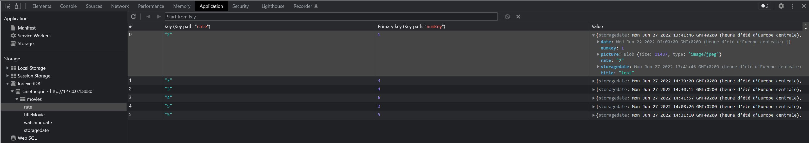

<!--
paginate: true
_paginate: false
headingDivider: 2
footer: 'ETML-ES / Introduction PWA'
header: ' [](https://github.com/NF01/mthw/blob/main/Partie6_Tri.md) '
size: 16:9
-->

 <!-- 
 script to link to html to enable darkmode
 <script defer src="index.js"></script>
 -->

<style>


@import url('https://fonts.googleapis.com/css2?family=Nunito&display=swap');
@import url('https://fonts.googleapis.com/css2?family=Red+Hat+Mono:wght@600&display=swap');
@font-face {
  font-family: 'icomoon';
  src: url('./fonts/icomoon.ttf') format('truetype');
}
section h1 {
  font-size: 1.5rem;
  font-family: 'Nunito';
  color: black;
  padding-bottom: 1rem;
  padding-top:10px
}
section.align h1{
  padding-bottom: 0.5rem
}

section p {
  font-size: 0.7rem;
  font-family: 'Nunito', sans-serif;
}

section footer {
  font-size: 0.5rem;
  font-family: 'Nunito', sans-serif;
}
section header a:nth-child(1):after{
  font-size: 0.9rem;
  font-family: 'icomoon', sans-serif;
  content: "\eab0";
  color: black;
  opacity: 30%
}
section::after {
  font-size: 1rem;
  font-family: 'Nunito', sans-serif;
}
section code{
  font-family: 'Red Hat Mono', monospace;
  font-size: 5rem
}
section a{
  color: #D10A11;
}

section li{
  font-size: 0.7rem;
  font-family: 'Nunito', sans-serif;

}

</style>

# Partie 6: Tri de l'information

Dans cette partie, nous allons nous concentrer sur comment trier les données de notre app. Nous allons donc trier les films par étoiles, par titre, par date de visionnage et par date de sauvegarde dans la DB.

# Champ de recherche

Les champs de recherche, que vous avez déjà surement dû utiliser sur des sites de e-commerce par exemple, sont des types de tri de l'information.

Nous avons déjà le squelette de notre champ de recherche puisque nous l'avons codé au début de ce cours, manque plus qu'à le faire marcher.

# Exercice pratique n°5 A

**DONNÉE**: le but est de coder une fonction qui sera appelée chaque fois que l'utilisateur rentrera de l'information dans le champ de recherche. Cette fonction devra cacher les films qui ne correspondent pas à la chaine de caractère entrée par l'utilisateur est au contraire laissé visible le/les films qui matche l'entrée de l'utilisateur.

**Règles**: cet exercice est un exercice de groupe (2 pers minimum, 4 pers maximum). Le but et que vous vous entraidiez pour réussir à coder la fonction et que vous construisiez qqch ensemble !

**Ressources**: Pour vous aider, voici un petit texte de la fonction:

_" Il faut déjà me donner la [valeur](https://www.w3schools.com/jsref/prop_attr_value.asp) que je devrais analyser. Puis faire une transformation dessus pour que je puisse me dépatouiller entre les grandes et les petites. À la suite de cela il restera à me donner les [éléments](https://developer.mozilla.org/fr/docs/Web/JavaScript/Reference/Global_Objects/String/indexOf) à faire disparaitre. Pour finir un petit tour de magie et hop hidden seront les films. "_

# Solution

```js
// à chaque "keyup" de l'utilisateur sur le champ de recherche la fonction est lancée
domOn("#bytitle", "keyup", () => {
  //je récupère la valeur
  const letters = document.querySelector("#bytitle").value;
  // je la tranfrome en majuscule
  const filter = letters.toUpperCase();
  //je chope tout les films
  const movies = document.querySelectorAll(".content-image");
  // je fais une boucle sur chaque film
  for (const movie of movies) {
    if (
      // si le titre du film en question que je mets aussi en majuscule matche l'entréé de l'utilisateur...
      movie.querySelector(".title").innerHTML.toUpperCase().indexOf(filter) > -1
    ) {
      //je laisse le film visible
      movie.classList.remove("hidden");
    } else {
      //je cache le film en question
      movie.classList.add("hidden");
    }
  }
});
```

# Tri dans la base de données

Dans la partie d'avant, nous avions créé des index dans notre DB. Allons jeter un coup d'œil à ceux-ci.

---

<!--backgroundColor: #212224-->



---

<!--backgroundColor: white-->

Nous pouvons voir que Indexed DB a automatiquement indexé / trié les éléments de la base par rapport au nombre d'étoiles qui leur avaient été attribués.

**ATTENTION**: il faut bien que le nom de l'index (ici rate => Key path) ait le même nom que la clé dans l'objet JS (ici rate => dans value)

Le tri est donc fait dans la base manque plus qu'à appeler le bon index au bon moment pour trier les films !

---

Pour commencer, il faut ajouter un paramètre à notre fonction _callDOM_ et rajouter un tri par index dans cette même fonction

```js
//AVANT
const callDOM = async () => {
  //pour supprimer le DOM puis le mettre à jour
  if (document.querySelectorAll(".content-image") != null) {
    document.querySelectorAll(".content-image").forEach((el) => el.remove());
  }

  db.transaction("movies").objectStore("movies").getAll().onsuccess = (
    event
  ) => {
    //code...
  };
};
```

---

```js
//APRES
//nouveau paramètre = choosenindex
const callDOM = async (choosenindex) => {
  //pour supprimer le DOM puis le mettre à jour
  if (document.querySelectorAll(".content-image") != null) {
    document.querySelectorAll(".content-image").forEach((el) => el.remove());
  }

  db
    .transaction("movies")
    .objectStore("movies")
    .index(`${choosenindex}`) //nouvelle ligne
    .getAll().onsuccess = (event) => {
    //code
  };
};
```

---

Avec un nouveau paramètre à la fonction callDOM cela veut dire qu'il faut envoyer un élément à chaque fois qu'on l'appelle.
Nous l'appelons en effet pendant le _onsucess_ de la DB.

```js
//AVANT
request.onsuccess = (event) => {
  db = event.target.result;
  callDOM();
  db.onerror = (event) => {
    console.error("Database error: " + event.target.errorCode);
  };
};
```

---

```js
//APRES
request.onsuccess = (event) => {
  db = event.target.result;
  callDOM(chossenindex); //changement
  db.onerror = (event) => {
    console.error("Database error: " + event.target.errorCode);
  };
};
```

_choosenindex_ ici étant une variable il faut la définir (tout au début du script après les imports). ON peut donc rajouter cette ligne.

```js
let choosenindex = "storagedate"; //ici on mettra dans la variable le nom d'un des indexs de la DB
```

Comme codé dans cet exemple, le DOM appelé par défaut sera la liste des films triée par leur date d'ajout dans la DB.

---

**MAIS** nous voulons pouvoir grâce au bouton de tri, trier nos films !!

Il y a juste à faire 3 fonctions qui changent le _choosenindex_ et qui appellent le DOM avec l'index voulu quand l'utilisateur clic sur le bouton.

```js
// A la fin du code global
//appel du DOM avec le bon tri dessus
domOn("#bystars", "click", () => {
  choosenindex = "rate";
  callDOM(choosenindex);
});

domOn("#bydate", "click", () => {
  choosenindex = "watchingdate";
  callDOM(choosenindex);
});

domOn("#reset", "click", () => {
  choosenindex = "storagedate";
  callDOM(choosenindex);
});
```

# Exercice pratique n°5 B

**DONNÉE**: mettez en place le tri par étoile, par date de visionnage et le reset du tri dans votre application.
