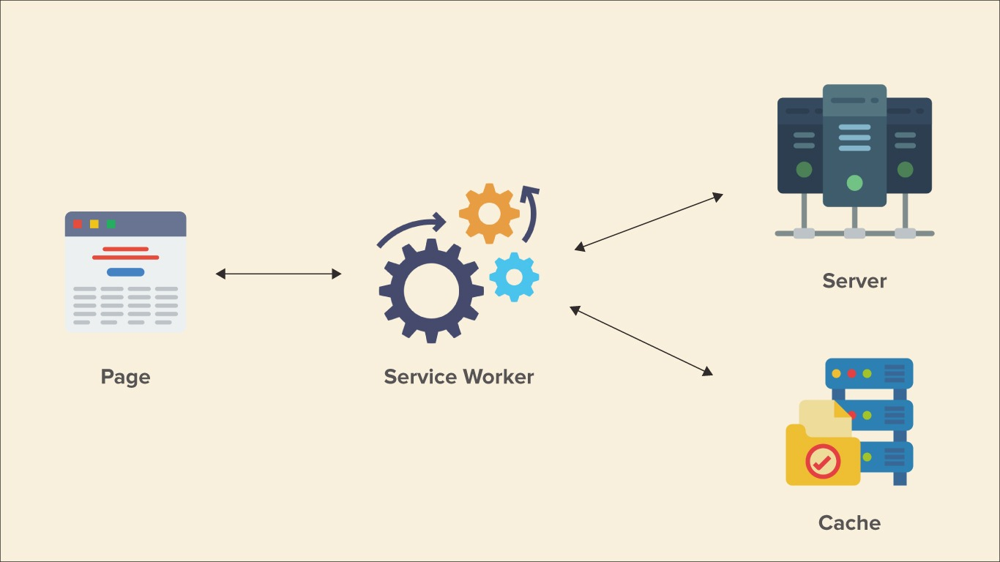
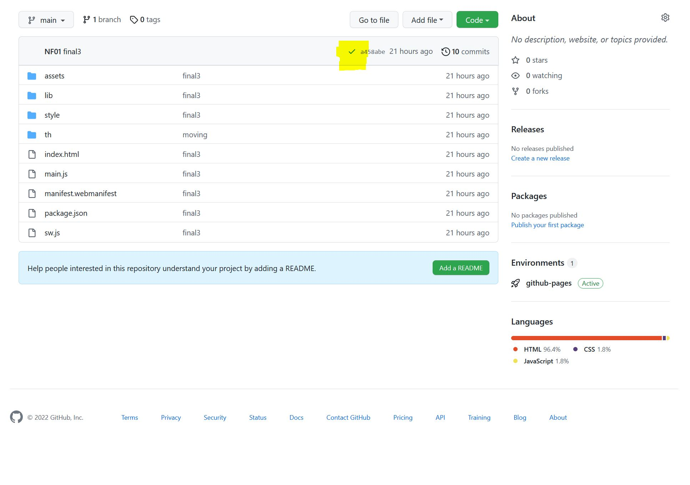

<!--
paginate: true
_paginate: false
headingDivider: 2
footer: 'ETML-ES / Introduction PWA'
header: ' [](https://github.com/NF01/mthw/blob/main/Partie8_Offline.md) '
size: 16:9
-->

 <!-- 
 script to link to html to enable darkmode
 <script defer src="index.js"></script>
 -->

<style>


@import url('https://fonts.googleapis.com/css2?family=Nunito&display=swap');
@import url('https://fonts.googleapis.com/css2?family=Red+Hat+Mono:wght@600&display=swap');
@font-face {
  font-family: 'icomoon';
  src: url('./fonts/icomoon.ttf') format('truetype');
}
section h1 {
  font-size: 1.5rem;
  font-family: 'Nunito';
  color: black;
  padding-bottom: 1rem;
  padding-top:10px
}
section.align h1{
  padding-bottom: 0.5rem
}

section p {
  font-size: 0.7rem;
  font-family: 'Nunito', sans-serif;
}

section footer {
  font-size: 0.5rem;
  font-family: 'Nunito', sans-serif;
}
section header a:nth-child(1):after{
  font-size: 0.9rem;
  font-family: 'icomoon', sans-serif;
  content: "\eab0";
  color: black;
  opacity: 30%
}
section::after {
  font-size: 1rem;
  font-family: 'Nunito', sans-serif;
}
section code{
  font-family: 'Red Hat Mono', monospace;
  font-size: 5rem
}
section a{
  color: #D10A11;
}

section li{
  font-size: 0.7rem;
  font-family: 'Nunito', sans-serif;

}

</style>

# Partie 8: le offline

Dans cette partie finale nous allons nous concentrer sur comment faire pour que notre application ne ressemble pas à ça... :

---


...quand elle ne trouve pas de connexion internet !

# Service workers

C'est grâce aux _Service Workers_ que nous allons réussir à faire cela.

- Premièrement il faut bien comprendre où un service workers va se positionner dans notre architecture. Juste ici :

---

<!--backgroundColor: #f8f0dd-->



---

<!--backgroundColor: white-->

- Notre service worker va agir en soi comme un proxy par lequel toutes les requêtes faites par l'app vont passer. À ce moment-là, nous pourrons donc décider de faire ce que nous voulons avec ces requêtes (les stopper, les laisser passer, les mettre en cache, les transformer, etc.) et donc les contrôler.

  **ATTENTION**: nous allons voir ici seulement un service worker qui permet de faire marcher notre PWA en mode offline. Puisque les seules ressources que nous allons chercher à travers le réseau sont des ressources statiques, le SW va se "contenter" d'aller chercher ses ressources une première fois quand il y a du réseau puis va les mettre dans un cache pour qu'elles soient réutilisées en offline. Le SW va aussi aller rechercher les ressources statiques quand il retrouvera du réseau. Il va comparer le cache et les données qu'il a reçus, et seulement si elles sont différentes, il va les remplacer.

- Pour commencer un peu de pratique pour mettre en place un SW.
  Il faut créer un nouveau fichier nommé _sw.js_
  Notre architecture de dossier ressemblera donc à ça (_italique_ = dossier / **gras** = fichier)

  - _dist_
    - _assets_
    - _style_
    - _lib_
    - **index.html**
    - **main.js**
    - **sw.js**

---

- Il faut maintenant enregistrer (dire à notre main.js qu'un service worker existe bien) notre SW.

```js
// dans main.js juste après les import
if ("serviceWorker" in navigator) {
  navigator.serviceWorker.register("sw.js"); //C'est une promesse = asynchronicité
} else {
  console.log("not working");
}
```

Lors de son déploiement **asynchrone,** le SW va passer par deux phases: son installation puis son activation.
Nous pouvons donc détecter différents événements lors de son déploiement.
Nous allons agir lors d'un événement spécial (le "installed", qui veut dire que le déploiement du service worker est fini) pour par la suite recharger la page. Ce rechargement permettra à une portion du code de notre fichier sw.js de s'activer (à voir au point suivant).

---

- Il faut donc maintenant chercher l'événement "installed"

```js
const sw = async () => {
  const registration = await navigator.serviceWorker.register("sw.js");
  registration.addEventListener("updatefound", (evt) => {
    evt.target.installing.addEventListener("statechange", (evt) => {
      if (evt.target.state === "installed") location.reload(); // il est là !
    });
  });
};

if ("serviceWorker" in navigator) {
  sw();
} else {
  console.log("SW not working / allowed");
}
```

---

Reste à coder notre Service Worker.

```js
const CACHE_NAME = "cinetheque";
const CACHE_VERSION = "1";

// à chaque fois que l'utilisateur va recharger la page un événement fetch va être lancé
self.addEventListener("fetch", (event) => {
  if (event.request.method != "GET") return;// si ce nest pas un GET je retourne
  const fetchCacheFirst = async () => {
    const cache = await caches.open(`${CACHE_NAME}_${CACHE_VERSION}`);// j'ouvre le cache
    const cached = await cache.match(event.request);// si le cache matche la requête,...
    if (cached) return cached;//...le cache est retourné
    let response = await fetch(event.request);// si le cache matche pas la réponse direction le network
    if (response) cache.put(event.request, response.clone());// si le network envoie une réponse elle est mise dans le cache
    return response;et la réponse est renvoyé
  };
  event.respondWith(fetchCacheFirst());
});

// quand un nouveau service worker est en place (changement de version), il efface le cache
self.addEventListener("activate", (event) => {
  const clearOldCache = async () => {
    let keys = await caches.keys();// je prends les clef du cache
    for (const key of keys) caches.delete(key);// et une à une je les delete
  };
  event.waitUntil(clearOldCache());
});
```

---

À la fin de cette démarche, vous pouvez aller inspecter votre code => sous application => sous Cache => Cache Storage et vous pourrez voir la liste des fichiers mis en cache. De plus vous pouvez changer la version du cache et recharger la page, vous verrez le cache précédent à disparu remplacé par la nouvelle version.

Vous pouvez maintenant vous mettre en mode offline et la pwa marche !

**DISCLAIMER**: Les service workers ont un pouvoir presque infini sur la manipulation de requêtes. L'exemple donné ici est un petit et simple exemple pour faire marcher une app en offline.

# Ressources

[Register service worker](https://developer.mozilla.org/en-US/docs/Web/API/ServiceWorkerContainer/register)

[Service worker API](https://developer.mozilla.org/en-US/docs/Web/API/Service_Worker_API)

[Web.dev](https://web.dev/offline-cookbook/)

[Global Doc MDN](https://developer.mozilla.org/en-US/docs/Web/Progressive_web_apps/Offline_Service_workers)

[Monterail](https://www.monterail.com/blog/pwa-working-offline)

[Service Workers explained](https://web.dev/learn/pwa/service-workers/)

[Le caching](https://web.dev/learn/pwa/caching/)

# Web Manifest

Voici le moment venu de faire de notre PWA une app installable et cela grâce au grand web manifest !

Un manifest web est un simple fichier JSON comportant les informations pour l'installation de notre PWA.

---

```json
{
  "name": "Ciné★thèque",
  "short_name": "Ciné★",
  "description": "A film library to put all the movies you have seen",
  "start_url": "/index.html",
  "icons": [
    {
      "src": "/assets/android-chrome-192x192.png",
      "sizes": "192x192",
      "type": "image/png"
    },
    {
      "src": "/assets/android-chrome-512x512.png",
      "sizes": "512x512",
      "type": "image/png"
    },
    {
      "src": "/assets/favicon-32x32.png",
      "type": "image/png",
      "sizes": "32x32"
    },
    {
      "src": "/assets/favicon-16x16.png",
      "type": "image/png",
      "sizes": "16x16"
    },
    {
      "src": "/assets/apple-touch-icon.png",
      "type": "image/png",
      "sizes": "180x180"
    }
  ],
  "theme_color": "#ff0000",
  "background_color": "grey",
  "display": "fullscreen",
  "orientation": "portrait-primary"
}
```

---

- Vous pouvez copier-coller le code de la slide précédente dans un nouveau fichier appelé _manifest.webmanifest_ et le mettre au même niveau que le _main.js_ et que le _sw.js_, puis le lié à votre HTML avec cette ligne de code:

```html
<link rel="manifest" href="./manifest.webmanifest" />
```

---

- Pour continuer, vous pouvez copier-coller le dossier **assets** présent dans _solutions_ -> _SolutionFinale_, il contient les différentes icônes de l'application.
  Et vous pouvez copier-coller ces 3 lignes dans _index.html_ pour avoir un favicon

```html
<link
  rel="apple-touch-icon"
  sizes="180x180"
  href="./assets/apple-touch-icon.png"
/>
<link
  rel="icon"
  type="image/png"
  sizes="32x32"
  href="./assets/favicon-32x32.png"
/>
<link
  rel="icon"
  type="image/png"
  sizes="16x16"
  href="./assets/favicon-16x16.png"
/>
```

# Ressources

[Web manifest Doc MDN](https://developer.mozilla.org/en-US/docs/Web/Manifest)

[Web.dev - web manifest mis en place](https://web.dev/learn/pwa/web-app-manifest/)

# Last but not least

Dernier des derniers points: le petit bonus = les Shortcuts !

Nous pouvons ajouter un bout de code pour que quand l'utilisateur appuiera longtemps sur l'icône de l'app sur mobile, il puisse choisir un raccourci. Nous allons en mettre un pour rajouter un film directement !

```json
// à rajouter dans le web manifest
   "shortcuts" : [
        {
          "name": "Add movies",
          "url": "/#add"
        }
    ],
```

# Déploiement

Pour déployer votre PWA et pouvoir tester son installation sur mobile, il faudra avoir déployé l'app sur un serveur. Quelle chance que GitHub nous laisse faire ça grâce à GitHub Pages. Comme je vous avais demandé au tout début, votre repository Github porte le nom _votrPseudo.github.io_. Après avoir déployé (commit and push) votre code sur GitHub (en étant connecté à votre compte et en ayant donc l'interface graphique de GitHub sous vos yeux) vous pourrez voir si vous cliquez là...:

---



---

... l'avancement du déploiement de votre code sur les serveurs de GitHub.
Quand cette étape sera achevée (= un vu vert) vous pourrez vous rendre sur l'URL dans un nouvel onglet de votre browser: _votrepseduo.github.io_. Normalement vous aurez une réponse 404. Si vous rajoutez _votrepseduo.github.io/dist_ cela devrait marcher et vous devriez voir votre PWA.

Cependant pour que la PWA soit installable il faut qu'elle soit en lien direct avec un nom de domaine n'ayant pas de sous-dossier. Ici nous en avons un (=dist), il faut donc modifier l'architecture de votre repository pour que l’index.html soit à la racine.

La nouvelle architecture devrait ressembler à ça (_italique_ = dossier / **gras** = fichier), le dist a simplement disparu, car il n'était utile que pour le live serveur.

- _assets_
- _style_
- _lib_
- **index.html**
- **main.js**
- **sw.js**

---

Voilà , vous venez de terminer le cours d'introduction au PWA. N'oubliez pas qu'il existe pléthore de possibilité pour faire évoluer cette PWA, je vous invite à continuer en autodidacte et je vous laisse avec quelques dernières ressources !

Bonne suite !

# Ressources globales

[Apprendre les PWA de A-Z](https://web.dev/learn/pwa/)

[Idées des web APIs pour développer une PWA](https://pwadvent.dev/)

[PWA like a native app](https://web.dev/app-like-pwas/)
